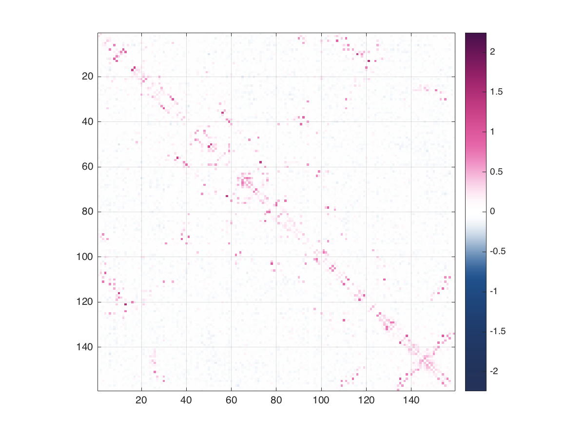
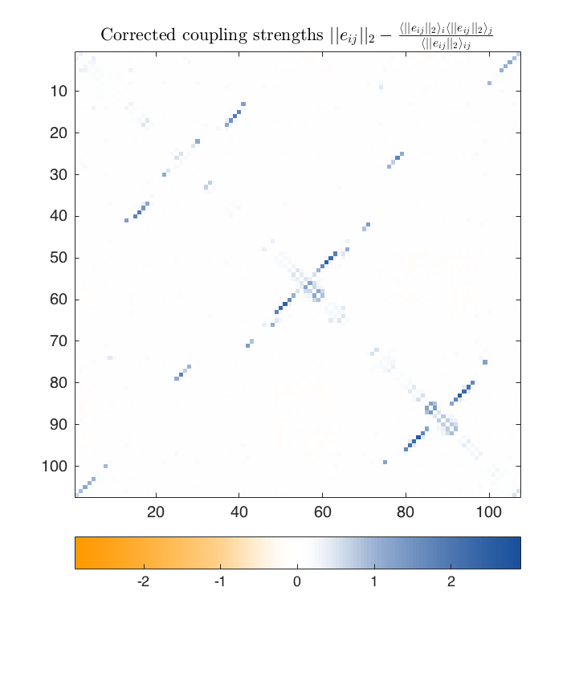

# plmc
plmc infers pairwise undirected graphical models for families of biological sequences. It implements a penalized, maximum-pseudolikelihood approach and supports custom alphabets as well as various forms of regularization. With a multiple sequence alignment as an input, plmc can quantify inferred coupling strengths between all pairs of positions (couplingsfile output) or infer a generative model of the sequences for predicting the effects of mutations (paramfile output).

## Usage
      plmc [options] alignmentfile
      plmc -c couplingsfile alignmentfile
      plmc -o paramfile -c couplingsfile alignmentfile
      plmc [-h | --help]
      
    Required input:
      alignmentfile                    Multiple sequence alignment in FASTA format

    Options, output:
      -c  --couplings  couplingsfile   Save coupling scores to file (text)
      -o  --output     paramfile       Save estimated parameters to file (binary)

    Options, alignment processing:
      -s  --scale      <value>         Sequence weights: neighborhood weight [s > 0]
      -t  --theta      <value>         Sequence weights: neighborhood divergence [0 < t < 1]

    Options, Maximum a posteriori estimation (L-BFGS, default):
      -lh --lambdah    <value>         Set L2 lambda for fields (h_i)
      -le --lambdae    <value>         Set L2 lambda for couplings (e_ij)
      -lg --lambdag    <value>         Set group L1 lambda for couplings (e_ij)

    Options, general:
      -a  --alphabet   alphabet        Alternative alphabet (default 21: -ACDEFGHIKLMNPQRSTVWY)
      -f  --focus      identifier      Select only uppercase, non-gapped sites from a focus sequence
      -g  --gapignore                  Exclude first alphabet character from potential calculations
      -m  --maxiter                    Maximum number of iterations
      -n  --ncores    [<number>|max]   Maximum number of threads to use in OpenMP
      -h  --help                       Usage

## Compilation
plmc can be compiled to single-core without external libraries, but requires OpenMP for multi-core compilation. On Mac OS X, `clang` does not yet support OpenMP, but versions of `GCC` that do can be found as precompiled binaries [here](http://hpc.sourceforge.net/) or downloaded through package managers like homebrew or macports.

**Multicore**. To compile with `gcc` and OpenMP: 

    make all-openmp

**Single core, Linux**. To compile with `gcc`: 

    make all

**Single core, Mac OS X**. To compile with `clang`:

    make all-mac

**Single precision**. All of the above targets compile to double precision (64 bit), but reducing the precision to single (32 bit) increases speed and decreases memory requirements by approximately a factor of two. The fastest compile settings are then:

    make all-openmp32

## Output

**Coupling scores**. The `couplingsfile` is a flat text file containing scores quantifying the inferred strength of the coupling between every pair of positions. It has 6 columns: `RES_I FOCUS_AI RES_J FOCUS_AJ 0 SCORE`, where `SCORE` is the coupling score between positions `RES_I` and `RES_J`, `FOCUS_AI` and `FOCUS_AJ` are the letters in the focus sequence (optional, `-` if no focus), `0` is a placeholder. The `SCORE` values are APC-corrected Frobenius norm scores, but alternative scores can be computed from the raw parameter values.

**Parameter estimates**. The model includes sequence-specific parameters for all possible pairs of amino acids at all possible pairs of postions, which is about 106-108 parameters for protein families of lengths ~70-700. If a `paramfile` is specified with `-o`, `plmc` will store all inferred parameter values in binary. The MATLAB script `scripts/read_eij.m` can load this binary file format into computable data structures.

## Examples
**Protein alignments**. The example directory includes an alignment of the protein [dihdyrofolate reductase](https://en.wikipedia.org/wiki/Dihydrofolate_reductase) (DHFR). To infer a model for this family, we can type the following in the base directory:

    bin/plmc -o example/protein/DHFR.params -le 16.0 -lh 0.01 -m 100 -g -f DYR_ECOLI example/protein/DHFR.a2m
The numeric options set a strong L2 regularization for the couplings, λe = 16.0, a weak L2 regularization for the sites, λh = 0.01, and the maximum number of iterations at 100. The focus `-f` option tells plmc to only model columns that are present in the E. coli sequence DYR_ECOLI, and the  `-g` gap-ignoring option ignores gaps by modeling only the coding portions of each sequence. To read the binary paramfile `DHFR.eij` and visualize the couplings, we can type the following in MATLAB from the `scripts` directory:

    params = read_params('../example/protein/DHFR.params');
    plot_coupling_scores(params)

This computes and plots the same (APC-corrected) coupling strengths that would be output to couplingfile, revealing many strongly coupled pairs of positions in the long-term evolution of DHFR:

**RNA alignments**. To override the default alphabet ("-ACDEFGHIKLMNPQRSTVWY" for proteins) use the option `-a ALPHABET`. An example RNA alignment is included for the [SAM riboswitch](https://en.wikipedia.org/wiki/SAM_riboswitch_(S_box_leader)). To infer the couplings with an RNA alphabet (".ACGU") type the following in the base directory:

    bin/plmc -c example/RNA/RF00162.EC -o example/RNA/RF00162.params -a .ACGU -le 20.0 -lh 0.01 -m 50 example/RNA/RF00162.fasta

To plot the aggregated coupling scores type the following in MATLAB from the `scripts` directory:

    params = read_params('../example/RNA/RF00162.params');
    plot_coupling_scores(params)

**Physical systems**. As an example, simulated draws from a 3-state, 1-dimensional Potts model are provided in the examples folder and encoded by the characters _, *, and ^. The following command would estimate the parameters by running to convergence with λe = 1.0, λh = 1.0 and sequence reweighting disabled:

    bin/plmc -c example/potts/potts3.txt -a _*^ -t -1 -le 1.0 -lh 1.0 example/potts/potts3.a2m
A 1D Potts model will only have interactions between i -> i + 1, which should be evident in the coupling summary scores output to example/potts/potts3.txt 

## References
The use of pseudolikelihood approximations for approximate inference of spin models for sequence families was established in the compsci/bioinformatics literature by

Balakrishnan, S., Kamisetty, H., Carbonell, J. G., Lee, S. I., & Langmead, C. J. (2011). [Learning generative models for protein fold families](http://onlinelibrary.wiley.com/doi/10.1002/prot.22934/abstract). Proteins: Structure, Function, and Bioinformatics, 79(4), 1061-1078.

and in the biophysics literature by

Ekeberg, M., Lövkvist, C., Lan, Y., Weigt, M., & Aurell, E. (2013). [Improved contact prediction in proteins: using pseudolikelihoods to infer Potts models](http://journals.aps.org/pre/abstract/10.1103/PhysRevE.87.012707). Physical Review E, 87(1), 012707.

`plmc` implements a joint optimization version of inference described in these and subsequent works (i.e. the 'symmetric' pseudolikelihood). If you'd like to use `plmc` in your own work, please cite one of the following papers that uses `plmc`. Also, please let us know if you have any comments or questions!

Hopf, T. A., Ingraham, J. B., Poelwijk, F. J., Springer, M., Sander, C., & Marks, D. S. (2015). [Quantification of the effect of mutations using a global probability model of natural sequence variation](http://arxiv.org/abs/1510.04612). arXiv:1510.04612.

Weinreb, C., Riesselman, A. J., Ingraham, J. B., Gross, T., Sander, C., & Marks, D. S. (2016). [3D RNA and Functional Interactions from Evolutionary Couplings](http://www.sciencedirect.com/science/article/pii/S0092867416303282). Cell.

## Author
plmc was written by [John Ingraham](mailto:john.ingraham@gmail.com) in [Debora Marks' lab](https://marks.hms.harvard.edu/) at Harvard Medical School

## Credits
The MAP-based inference uses a [C implementation of L-BFGS by Naoaki Okazaki](https://github.com/chokkan/liblbfgs "libLBFGS"), which is included in this repo

